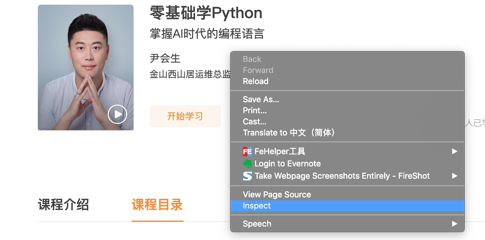
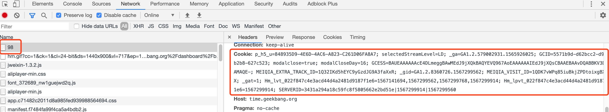

极客时间的一些工具。主要有：

1. 视频下载。
2. 把m3u8格式视频转成mp4。

<hr>

## 编译安装

`make install`

## 下载视频

```
./download -h
Usage of ./download:
  -cookie string
        cookie after login
  -courseID string
        course id
  -output string
        output dir (default ".")
```

### 参数说明

* -cookie 登入以后的cookie。
* -courseID 课程id。
* -output 输出的目录。

#### 获取cookie和课程id

打开“我的订阅”页面，点击“视频课”，再点击具体课程的“开始课程”按钮。


打开新页面以后，地址栏上面中最后的数字就是**课程ID**。


在打开开发者工具。



刷新页面，按照下图在开发者工具中找到**cookie**。



### 输出说明

下载完以后输出的目录结构如下：

```
▾ <ouput>/
  ▸ 零基础学Python/
    ▸ ...
    ▾ 04Python程序的书写规则/
        ff3047ed446d4c0c9fb943c53cd3b280-bc7bb966a60152c38738816463e884f0-ld.m3u8
        ff3047ed446d4c0c9fb943c53cd3b280-daff7a35190b428de623d5df1f031364-ld-00001.ts
        ...
        ff3047ed446d4c0c9fb943c53cd3b280-daff7a35190b428de623d5df1f031364-ld-00018.ts
        m3u8_addr
    ▸ ...
 ▸ download.log
```

说明：

1. 一级目录是课程名字。
2. 二级目录是课程中每课的序号加上名称，二级目录中包含`.m3u8`/`.ts`文件。另外，二级目录中还包含了一个`m3u8_addr`文件，内容是`.m3u8`文件的地址。
3. `downloag.log`下载的日志。

## m3u8格式转成mp4

把**下载器下载**的m3u8格式的视频转换成mp4格式。

依赖ffmpeg。

```
Usage of ./m3u8tomp4:
  -input string
        input dir, generated by the downloader
  -output string
        output dir
```

### 参数说明

* -input，包含下载工具下载的内容的目录。
* -ouput，输出目录。

### 输出说明

mp4的名字和每课的名称相同。

```
▾ <output>/
    01Python语言的特点.mp4
    02Python的发展历史与版本.mp4
    03Python的安装.mp4
    04Python程序的书写规则.mp4
    05基础数据类型.mp4
    06变量的定义和常用操作.mp4
    07序列的概念.mp4
    08字符串的定义和使用.mp4
    09字符串的常用操作.mp4
    10元组的定义和常用操作.mp4
    11列表的定义和常用操作.mp4
    ...
```

